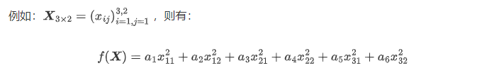
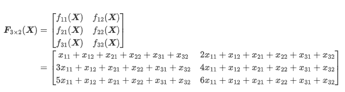
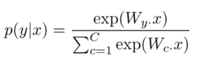
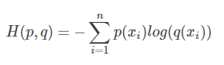

# machine-learning
machine learning note

# 数学

#### 函数，变元

考虑一个函数:
$$
\text { function(input) }
$$

1. $function$ 是标量， 则$function $ 是 $input$ **所有元素所组成的函数**。



2. $function$是向量或者矩阵，$function$ 中的**每个元素**都是 $input$ **中所有元素组成的标量函数**。



#### 矩阵求导

$fuction$ 中的每个$f$ 对变元中的每个$x$ 求偏导

分子布局：列向量在分子

分母布局：列向量在分母


# tensorflow2.0

## API

- `tf.square()` :对输入张量的每一个元素求平方，不改变张量形状。
- `tf.reduce_sum()`: 求和，可以通过 `axis` 参数来指定求和的维度，不指定则默认对所有元素求和。
- `tf.keras.losses.categorical_crossentropy` : 交叉熵，标签使用onehot编码

```python
loss = tf.keras.losses.sparse_categorical_crossentropy(y_true=y, y_pred=y_pred)
```

- `tf.keras.losses.sparse_categorical_crossentropy`: 交叉熵，标签可以使用int型的标签

```python
loss = tf.keras.losses.categorical_crossentropy(
    y_true=tf.one_hot(y, depth=tf.shape(y_pred)[-1]),
    y_pred=y_pred
)
```

## 线性回归

```python
import tensorflow as tf

X = tf.constant([[1.0, 2.0, 3.0], [4.0, 5.0, 6.0]])
y = tf.constant([[10.0], [20.0]])


class Linear(tf.keras.Model):
    def __init__(self):
        super().__init__()
        self.dense = tf.keras.layers.Dense(
            units=1,
            activation=None,
            kernel_initializer=tf.zeros_initializer(),
            bias_initializer=tf.zeros_initializer()
        )

    def call(self, input):
        output = self.dense(input)
        return output


# 以下代码结构与前节类似
# 定义模型
model = Linear()
# 定义优化器
optimizer = tf.keras.optimizers.SGD(learning_rate=0.01)
for i in range(100):
    # 梯度记录
    with tf.GradientTape() as tape:
        y_pred = model(X)      # 调用模型 y_pred = model(X) 而不是显式写出 y_pred = a * X + b
        # 在这里记录loss函数
        loss = tf.reduce_mean(tf.square(y_pred - y)) # 所有元素平方求和
    # 根据loss计算关于变量的损失
    grads = tape.gradient(loss, model.variables)    # 使用 model.variables 这一属性直接获得模型中的所有变量
    optimizer.apply_gradients(grads_and_vars=zip(grads, model.variables))
print(model.variables)
```


```
epochs=10
model = Linear()
optimizer = tf.keras.optimizers.Adam(learning_rate=0.01)

for i in tqdm(range(epochs), desc='epochs:'):
    with tf.GradientTape() as tape:
        # 前向传播
        y_pred = model(X)
        # 定义损失
        loss = tf.reduce_mean(tf.square(y_pred - Y))
    # 计算梯度
    grads = tape.gradient(loss, model.variables)
    # 根据梯度更新变量
    optimizer.apply_gradients(grads_and_vars=zip(grads, model.variables))

print(model.variables)
```


## softmax





- 该向量中的每个元素均在 [0, 1] 之间
- 该向量的所有元素之和为1


## 交叉熵



- `p(xi)`: x是第i类的真实概率

- `q(xi)`: x是第i类的预测概率


# numpy

`np.expand_dims`: 扩展数组的维度
